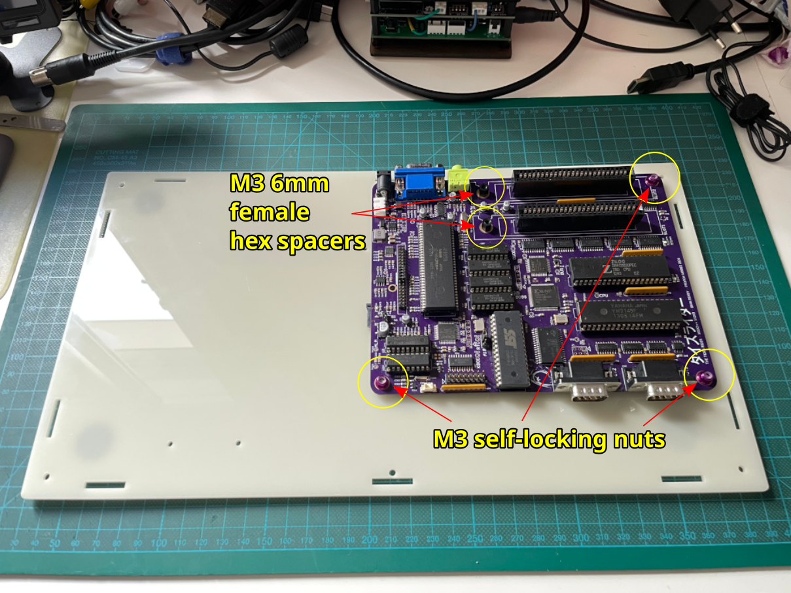
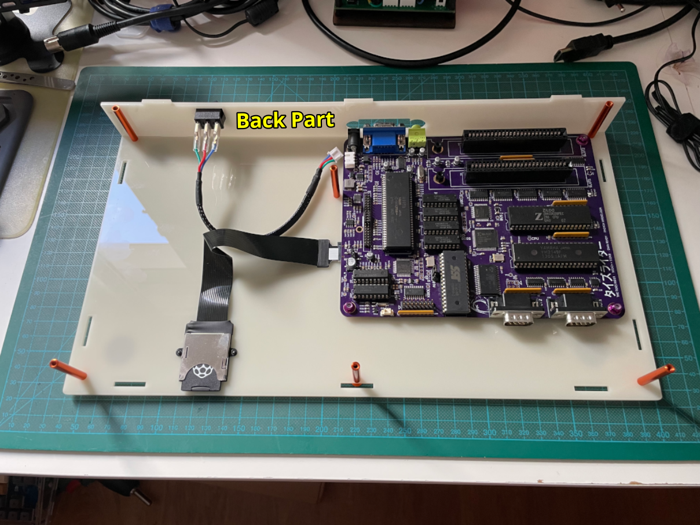

# Build instructions for the Tides Rider acrylic enclosure v1

## Bill Of Materials

| **use**                     | **item**                                       | **req_pcs** | **item_description**                                                                                                             | **item_option**                                          | **pcs_per_item** | **req_items** | **link**                                                                                                       |
| --------------------------- | ---------------------------------------------- | ----------- | -------------------------------------------------------------------------------------------------------------------------------- | -------------------------------------------------------- | ---------------- | ------------- | -------------------------------------------------------------------------------------------------------------- |
| Case                        | rubber feet                                    | 4           | Black Rubber Self-adhesive Pads Furniture Protectors Shock Absorber Foot Pad Vibration Absorption Rubber Anti-shock              | Color: 20x5mm-Arc, Number of Pcs: 5 Pcs                  | 10               | 1             | [https://www.aliexpress.com/item/1005007592747332.html](https://www.aliexpress.com/item/1005007592747332.html) |
| Case (spacers)              | M3 35mm aluminum round spacer                  | 6           | 5/10pcs/lot aluminum spacer M3\* 10mm to 100mm Anodized colourful aluminum Column Rods round standoff spacer                     | M3 Thread, M3x35 10PCS, orange                           | 10               | 1             | [https://www.aliexpress.com/item/1005006073165446.html](https://www.aliexpress.com/item/1005006073165446.html) |
| Case (special screw)        | M3 torx 8mm flat screw black                   | 1           | 10/ 20/ 50pcs Black Zinc-Plated 304 Stainless Steel M2 M2.5 M3 M4 M5 M6 CM Torx Six-Lobe Ultra Thin Flat Wafer Head Screw Bolt   | M3x8mm (50pcs), Black Stainles Steel                     | 50               | 1             | [https://www.aliexpress.com/item/1005007534615994.html](https://www.aliexpress.com/item/1005007534615994.html) |
| DE9 extension cables        | 4-40 UNC 5/6 inch ~8mm pan head screw          | 4           | 10/50pcs UNC 2#-56 4#-40 6#-32 8#-32 10#-24 12#-24 US Coarse Thread 304 Stainless Steel Cross Round Phillips Pan Head Screw Bolt | 50pcs 4-40, 5/16”                                        | 50               | 1             | [https://www.aliexpress.com/item/1005003127103343.html](https://www.aliexpress.com/item/1005003127103343.html) |
| DE9 extension cables        | DE9 female to male extension cable             | 2           | 1PCS 20CM 50CM 1M DB9 MALE to FEMALE CABLE D-Sub serial port connector adapter rs232 com Extension Cable                         | 1PCS 20CM                                                | 1                | 2             | [https://www.aliexpress.com/item/33029129554.html](https://www.aliexpress.com/item/33029129554.html)           |
| keyboard (bottom)           | M3 torx 8mm flat screw stainless steel         | 6           | 10/ 20/ 50pcs Black Zinc-Plated 304 Stainless Steel M2 M2.5 M3 M4 M5 M6 CM Torx Six-Lobe Ultra Thin Flat Wafer Head Screw Bolt   | M3x8mm (50pcs), Stainles Steel                           | 50               | 1             | [https://www.aliexpress.com/item/1005007534615994.html](https://www.aliexpress.com/item/1005007534615994.html) |
| Keyboard (cable)            | 16pin IDC cable colored                        | 1           | 1/3/5Meter 6/8/10/16/18/20/26/34/40P 1.27mm Pitch Color Grey Flat Ribbon Cable Rainbow DuPont Wire For IDC 2.54mm FC Connector   | 1Meter                                                   | 5                | 1             | [https://www.aliexpress.com/item/1005005382567357.html](https://www.aliexpress.com/item/1005005382567357.html) |
| Keyboard (cable)            | 16pin IDC female socket                        | 2           | 10PCS 2.54MM Pitch 6 Position 8 10 12 14 16 18 20 24 26 30 34 40 Pin Female IDC Socket IDC Connector Ribbon Cable                | FC-16P                                                   | 10               | 1             | [https://www.aliexpress.com/item/4000669421323.html](https://www.aliexpress.com/item/4000669421323.html)       |
| Keyboard (spacers)          | M3 10mm aluminum round spacer                  | 6           | 5/10pcs/lot aluminum spacer M3\* 10mm to 100mm Anodized colourful aluminum Column Rods round standoff spacer                     | M3 Thread, M3x10 10PCS, orange                           | 10               | 1             | [https://www.aliexpress.com/item/1005006073165446.html](https://www.aliexpress.com/item/1005006073165446.html) |
| keyboard (top)              | M3 torx 8mm countersunk screw black            | 6           | 50/ 20/ 10/ 5pcs M1.6 M2 M2.5 M3 M4 M5 M6 GB2673 Black A2-70 304 Stainless Steel Torx Head Flat Countersunk Screw Six Lobe Bolt  | M3 (20pcs), 8mm                                          | 20               | 1             | [https://www.aliexpress.com/item/1005004146839227.html](https://www.aliexpress.com/item/1005004146839227.html) |
| Motherboard (bottom)        | M3 torx 12mm countersunk screw steinless steel | 6           | 10/50pcs M1.4 M1.6 M2 M2.5 M3 M4 M5 M6 GB2673 304 A2 Stainless Steel Six Lobe Torx Flat Countersunk Head Screw Bolt L=3-60mm     | 50pcs M3, 12mm                                           | 50               | 1             | [https://www.aliexpress.com/item/1005002369233576.html](https://www.aliexpress.com/item/1005002369233576.html) |
| Motherboard (nuts)          | M3 self-locking nuts                           | 3           | 10pcs M3/M4 Aluminum Alloy Flange Nylon Insert Lock Nut Self-locking Nut With Anti-skid Rubber Ring For Rc Car Scx10 Traxxas Rgt | M3 purple 10pcs                                          | 10               | 1             | [https://www.aliexpress.com/item/1005006096663920.html](https://www.aliexpress.com/item/1005006096663920.html) |
| Motherboard (slot nuts)     | M3 6mm female hex spacers                      | 2           | 20/ 50Pcs M2 M2.5 M3 M4 M5 Black/ White Nylon Hex Female to Female Standoff Nylon Plastic Hexagon Thread PCB Motherboard Spacer  | M3 (20pcs), 6mm                                          | 20               | 1             | [https://www.aliexpress.com/item/1005004311987482.html](https://www.aliexpress.com/item/1005004311987482.html) |
| motherboard (spacers)       | M3 4mm washers                                 | 4           | 20-50pcs M3 M4 m5 m6 m8 black Nylon ABS Non-Threaded Spacer Round Hollow Standoff Washer ID 3mm 4mm PCB Board Screw Bolt         | Size: M3X4 50pcs                                         | 50               | 1             | [https://www.aliexpress.com/item/33011990846.html](https://www.aliexpress.com/item/33011990846.html)           |
| power switch cable assembly | 22AWG silicone wire red, green, blue           | 1           | Heat Resistant Soft Silicone Wire 5 Colors in A Box Kit 30/28/26/24/22/20/18AWG Stranded Cable Electrical Tinned Copper Wire     | 22AWG 25metres                                           | 50               | 1             | [https://www.aliexpress.com/item/1005005888991575.html](https://www.aliexpress.com/item/1005005888991575.html) |
| power switch cable assembly | 3pin XH2.54 female housing                     | 1           | 100Pcs JST XH2.54 2/3/4/5 Pin Terminals Plastic Shell Male Plug + Female Socket Wire Connector XH 2.54 2P 3P 4P 5P               | Color: 3Pin, Package Quantity: 100Pcs Female             | 100              | 1             | [https://www.aliexpress.com/item/1005003422202370.html](https://www.aliexpress.com/item/1005003422202370.html) |
| power switch cable assembly | 3pin XH2.54 female terminals                   | 3           | 100Pcs JST XH2.54 2/3/4/5 Pin Terminals Plastic Shell Male Plug + Female Socket Wire Connector XH 2.54 2P 3P 4P 5P               | Color: 100Pcs Metal Pin, Package Quantity: 100Pcs Female | 100              | 1             | [https://www.aliexpress.com/item/1005003422202370.html](https://www.aliexpress.com/item/1005003422202370.html) |
| power switch cable assembly | Black braid sleeving 10mm                      | 10          | Dropship 1/5/10/50/M Black Insulated Braid Sleeving 4/6/8/10/12/14/20/25mm Tight PET Wire Cable Gland Protection Cable Sleeve    | Color: 10MM, Inner Diameter: 1 Meter                     | 100              | 1             | [https://www.aliexpress.com/item/1005002741251580.html](https://www.aliexpress.com/item/1005002741251580.html) |
| power switch cable assembly | Faston 6.3mm female terminals                  | 3           | 50/100Pcs Electric Wire Connectors Set 4.8/6.3mm With lock Female and male Crimp Terminal Connector Brass Silver Car Speaker     | MIX6.3mm(Lock)100PCS                                     | 50               | 1             | [https://www.aliexpress.com/item/1005007353948483.html](https://www.aliexpress.com/item/1005007353948483.html) |
| power switch cable assembly | SPDT switch                                    | 1           | 10Pcs KCD1 Series 2/3/4 Pin Boat Car Rocker Position Power Switches 15mm x 21mm Black Red Green 6A/250V 10A/125V AC Wholesale    | Black 3Pin                                               | 10               | 1             | [https://www.aliexpress.com/item/1005006332969902.html](https://www.aliexpress.com/item/1005006332969902.html) |
| power switch replacement    | 3pin XH2.54 male connector angle               | 1           | 50PCS/Lot XH2.54 Right Angle Pin Header Connector 2P 3P 4P 5P 6P 2.54mm Pitch XH For PCB JST                                     | 3P                                                       | 50               | 1             | [https://www.aliexpress.com/item/33008489410.html](https://www.aliexpress.com/item/33008489410.html)           |
| reset button cable assembly | 3pin female dupont housing                     | 1           | Dupont Plastic Shell Plug 2.54mm Single Row Dupont Connector 1P/2P/3P/4P/5P/6P/7P/8P/9P/10P Housing                              | 50PCS, 3P                                                | 50               | 1             | [https://www.aliexpress.com/item/4001129080280.html](https://www.aliexpress.com/item/4001129080280.html)       |
| reset button cable assembly | Reset button with wire                         | 1           | 19/22/25/30mm Ultra Short LED Light Switch 3V 6V 12V 24V 220V Momentary Self Reset Waterproof Metal Push Button Switch with Wire | No LED, 3-6V, 16MM with wires, Black-momentary           | 1                | 1             | [https://www.aliexpress.com/item/1005004920346156.html](https://www.aliexpress.com/item/1005004920346156.html) |
| reset button replacement    | 3pin 2.54mm male header right angle            | 1           | 10PCS 1x40P 1\*40 Pin 2.54mm Single Row single pin curved Pin Header Connector Strip Curved Needle                               | 1x40P ( 10Pcs )                                          | 133              | 1             | [https://www.aliexpress.com/item/1005004924720674.html](https://www.aliexpress.com/item/1005004924720674.html) |
| reset cable assembly        | Black braid sleeving 6mm                       | 30          | Dropship 1/5/10/50/M Black Insulated Braid Sleeving 4/6/8/10/12/14/20/25mm Tight PET Wire Cable Gland Protection Cable Sleeve    | Color: 6MM, Inner Diameter: 1 Meter                      | 100              | 1             | [https://www.aliexpress.com/item/1005002741251580.html](https://www.aliexpress.com/item/1005002741251580.html) |
| SD Card extension cable     | M2.5 6mm flat screws                           | 2           | 5/10/50pc CM Torx thin screw M2 M2.5 M3 M4 M5 M6 M8 A2-70 Stainless Steel black colour Six-Lobe Ultra Thin Flat Wafer Head Screw | M2.5 50pcs, x6mm                                         | 50               | 1             | [https://www.aliexpress.com/item/1005007534615994.html](https://www.aliexpress.com/item/1005007534615994.html) |
| SD Card extension cable     | SD card extension cable                        | 1           | SD card Female to TF micro SD Male (SD to TF)Flexible Memory Card Extension cable Extender Adapter reader Cord Linker 20/48cm    | 20cm                                                     | 1                | 1             | [https://www.aliexpress.com/item/4001236861433.html](https://www.aliexpress.com/item/4001236861433.html)       |
| Various                     | M3 countersunk washer                          | 24          | 10pcs Aluminum washer M3 color aluminum alloy cap washers for RC model parts for countersunk screws Gasket                       | Orange                                                   | 10               | 3             | [https://www.aliexpress.com/item/1005005977321415.html](https://www.aliexpress.com/item/1005005977321415.html) |
| Various                     | M3 torx 10mm countersunk screw steinless steel | 11          | 10/50pcs M1.4 M1.6 M2 M2.5 M3 M4 M5 M6 GB2673 304 A2 Stainless Steel Six Lobe Torx Flat Countersunk Head Screw Bolt L=3-60mm     | 50pcs M3, 10mm                                           | 50               | 1             | [https://www.aliexpress.com/item/1005002369233576.html](https://www.aliexpress.com/item/1005002369233576.html) |

## Motherboard customization

The Tides Rider motherboard comes preinstalled with a power switch and a reset button, but those are not suitable for the acrylic enclosure presented here.

Those elements must be de-soldered and replaced with headers so that externally accessible component alternatives can be used.

### Required materials

* 1x 2.54mm male pin header right angle (3 pins)
* 1x XH2.53 3-pin male header right angle

### Power switch replacement

De-solder the SPDT power switch.
* First cut its three legs from the top side of the motherboard using cutting pliers.
  Cutting the legs allows de-soldering each leg independently, avoiding the risk of damaging the motherboard tracks and pads if you try to desolder the complete switch at once.
* Then using a de-soldering iron (or an iron and a solder sucker) de-solder and extract one by one the remains of the switch legs, and de-solder the additional two support legs.
  Do this from the bottom face of the motherboard, and use lots of flux and maybe extra solder to make the de-soldering process easier.
* Using de-soldering wick clean any solder remains from the 3-pin footprint and make sure the holes are completely free of solder.
* Thoroughly clean flux residues using 99% isopropyl alcohol.

Install the new power header.
* Insert the XH2.54 3pin right angle header into the cleaned footprint for the previous SPDT switch
* Solder the XH2.54 header pins from the bottom face of the motherboard.

### Reset button replacement

First, prepare a 2.45mm 3pin header (without a center pin) to replace the SMD reset button.

* Take out the center pin of the 2.54mm 3pin header using pliers.
* Remove too one of the remaining side pins using the same method.
* Reinsert the same pin again on the same header hole _but flipping it first_ so that the pin angle is the opposite of the non-removed pin in the header
* Make sure that both pins are inserted the same length so that the header can sit flat perpendicular to a flat surface

Then, replace the SMD reset button with the header.

De-solder the SMD reset button.
* Using a soldering iron and extra flux heat all reset button pins at once to allow displacing the reset button out from its footprint. Take out the reset button once free.
* Using de-soldering wick clean any solder remains from the SMD button footprint and make sure the pads are completely free of solder and flat.
* Thoroughly clean flux residues using 99% isopropyl alcohol.

Install the new reset header.
* Place and align the new header vertically over the SMD button footprint making sure the header legs touch two opposite pads of the SMD button footprint.
* Solder the 3-pin header two angled pins to two of the SMD button pads, making sure there is good contact between pins and pads. Do this from the top face of the motherboard.

## Cables and cable assemblies

### Reset button cable assembly

TBD

### Keyboard IDC cable

TBD

### Power switch cable assembly

TBD

### DE9 extension cables

The two DE9 extension cables are standard 20cm DE9 D-Sub male to female cables that you can easily find in [Aliexpress](https://www.aliexpress.com/item/33029129554.html) (2x Option: 1PCS 20CM).

### SD card extension cable

The SD card extension cable is a standard 20cm SD card female to TF micro SD male flexible cable extender that you can easily find in [Aliexpress](https://www.aliexpress.com/item/4001236861433.html) (Option: 20cm).

## Acrylic parts

* One 3mm DINA3 297×420mm colored opaque acrylic sheet (cream color in the images)

* One 3mm DINA3 297×420mm semi-transparent acrylic sheet (tobacco color in the images)

## Keyboard Top

### Required materials

* 6x M3 8mm flat screws (metal)
* 6x M3 10mm aluminum round spacers (orange)
* 6x M3 countersunk aluminum washers (orange)
* 6x M3 8mm countersunk screws (black)
* Keyboard 16p IDC cable (18-20cm)
* Flat 16mm diameter Reset button and cable assembly ended in 3x 2.54mm Dupont female header (with middle pin unused)

### Assembly instructions

1. Identify the `Keyboard PCB` holes where round spacers need to be installed.

2. Insert six M3 8mm flat screws into the identified holes, and secure them with a small blob of Blue Tack.

3. Flip the `Keyboard PCB`, and identify the six screws added in the previous step.

5. Add six M3 10mm round spacers to the six screws.

6. Flip again the `Keyboard PCB` over, remove the temporary Blue Tack from the six screws, and make sure the six round spacers are fully screwed to the six screws.

7. Prepare the `Keyboard Top` part.

8. Insert the Reset button and cable assembly through the reset button hole on the `Keyboard Top` part.

   Make sure the button stays on the outside face of the `Keyboard Top` part.

9. Flip the `Keyboard Top` part over and make sure the Reset button is fully inserted into the reset button hole.

   The rubber washer and nut should also be inserted on the cable, heading to the Reset button in that order.

10. Install first the rubber washer into the Reset button thread.

11. Screw the reset button nut.

    The rubber washer must remain between the `Keyboard Top` part and the reset button nut to avoid the metal nut scratching the acrylic.

12. Go back to the `Keyboard PCB` and install the Keyboard IDC cable.

    Make sure pin 1 of the cable matches pin 1 of the `Keyboard PCB` IDC connector.

13. Place and align the `Keyboard Top` on top of the `Keyboard PCB` so that the `Keyboard Top` holes stay on top of the round spacers.

14. Use six M3 8mm countersunk screws and six countersunk washers to secure the `Keyboard Top` to the `Keyboard PCB`.

## Rest of the Case

### Required material

### Assembly instructions

1. Take the `Bottom` part with the outside face looking upwards and add four rubber feet at each corner.

2. Insert five M3 12mm countersunk screws and five countersunk washers, each secured by a small blob of Blue Tack.

   You may need to add temporary stands to elevate the `Bottom` part about 3cm to facilitate the insertion of the screws.

3. Flip the `Bottom` part over to access the inside face and identify the screws added in the previous step.

4. Add five M3 4mm washers on top of the five M3 12mm countersunk screws.

   Those washers act as separators between the motherboard and `Bottom` part to provide enough clearance and facilitate heat dissipation.

5. Align and slide the Tides Rider motherboard onto the M3 12mm countersunk screws, making the motherboard sit on the M3 4mm washers.

6. Secure the motherboard to the `Bottom` part of the enclosure.

   Use two M3 6mm female hex spacers on the screws at the computer slots, and three M3 self-locking nuts at the remaining three screws.

7. Flip the `Bottom` part over, remove the Blue Tack blobs and make sure all screws are fully tightened.

8. Place the SD card extension cable socket over the `Bottom` part and align it to its corresponding M2.5 holes.

9. Insert two M2.5 6mm flat screws from the outside of the `Bottom` part and make sure they are fully aligned with the SD card extension cable socket holes.

10. Fully screw the M2.5 6mm flat screws to the SD card extension cable socket holes.

    The SD card socket will stay flat over the `Bottom` part.

11. Identify and correctly orientate the micro SD card connector of the SD card extension cable in preparation for its insertion into the micro SD card socket of the Tides Rider motherboard.

    The micro SD card socket on the motherboard is installed on the bottom side of the motherboard, so the micro SD card connector pins must face upwards for a proper insertion.

12. Fully insert the micro SD card connector of the SD card extension cable into the micro SD card socket of the Tides Rider motherboard.

    Insert the connector until you hear the "clic" sound indicating a full insertion.

13. Flip the `Bottom` part over to access the outside face and insert six M3 10mm countersunk screws and six M3 countersunk washers, securing each with a small blob of Blue Tack.

14. Flip the `Bottom` part over again and identify the screws added in the previous step.

15. Add six M3 25mm aluminum round spacers on top of the six M3 10mm countersunk screws.

16. Flip once more the `Bottom` part over, remove the temporary Blue Tack from the six screws, and make sure the six round spacers are fully screwed to the six screws.

17. Take the `Back` part and insert the Power switch cable assembly from the outside to the inside so that the SPDT power switch stays at the outside and the XH2.54 connector at the inside.

    Make sure the power switch `On` symbol is right next to the engraved `On` text on the power switch hole.

18. Fully insert the SPDT power switch into the `Back` part.

19. Insert the `Back` part into the `Bottom` part of the enclosure.

20. Plug the XH2.54 connector of the SPDT switch cable assembly into the XH2.54 socket of the Tides Rider customized motherboard.

21. Take the `Front` part and place and align the first DE9 extension cable into the corresponding DE9 hole.

    The DE9 male connector must remain at the inside face of the `Front` part.

22. Use two 4-40 UNC 5/16 inch pan head screws to secure the first DE9 extension cable to the `Front` part.

23. Secure the second DE9 extension cable in the same way as the first one.

24. Connect the two DE9 extension cable female connectors to their respective DE9 male connector on the Tides Rider motherboard.

    Please note that joystick Port 1 on the Tides Rider motherboard is the rightmost connector.

25. Insert the `Front` part into the `Bottom` part of the enclosure.

26. Insert the `Left` and `Right` parts into the `Bottom` part of the enclosure.

    Note that the `Right` part is translucid so that you can take a look at the Tides Rider motherboard from the right side, including checking some of the LEDs.

27. Take the assembled `Keyboard Top` part and plug the Keyboard cable into the Keyboard connector header of the motherboard, and the do the same with the Reset button cable.

    Make sure pin 1 of the keyboard cable connector matches pin 1 of the Todes Rider motherboard keyboard IDC connector.

28. Place and insert the `Keyboard Top` part into the the `Front`, `Right`, `Back` and `Left` parts using the corresponding tabs.

29. Finally, secure the `Keyboard Top` part using five M3 10mm countersunk screws and five countersunk washers, and one M3 8mm flat screw, for a total of six screws.

    The M3 8mm flat screw is the one attaching to the hole close to the keyboard space bar.

