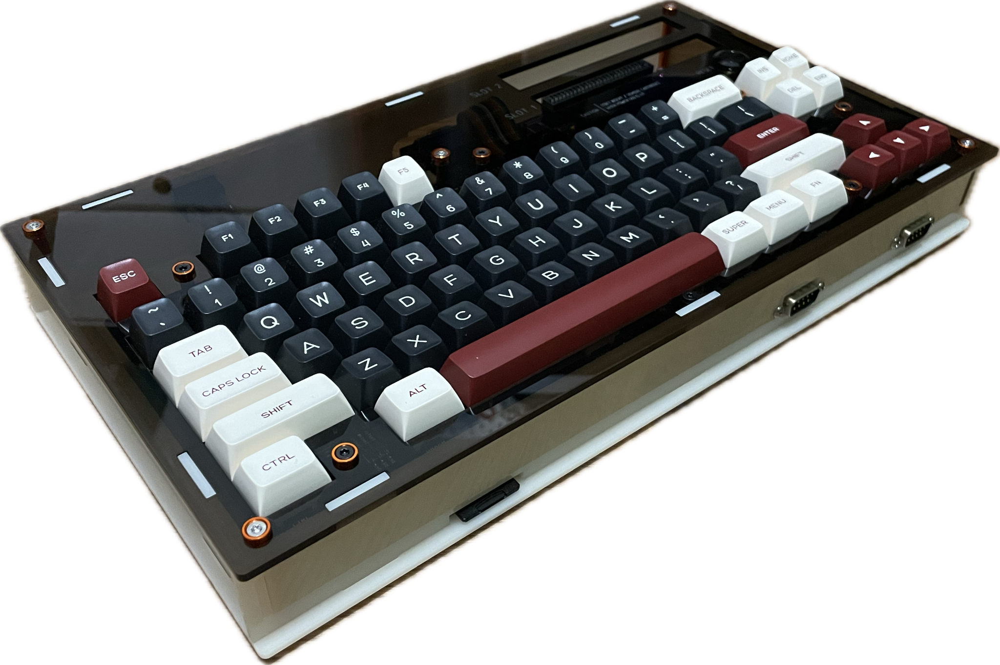
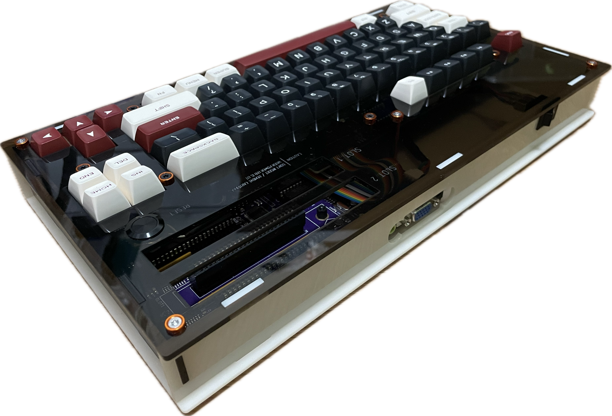
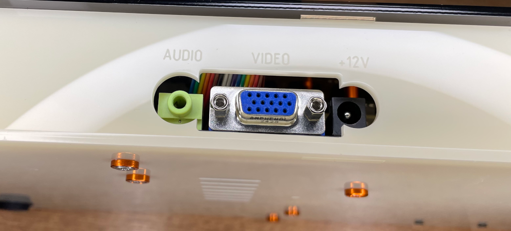
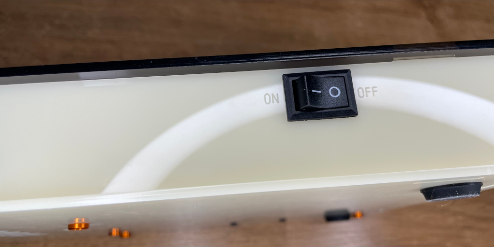
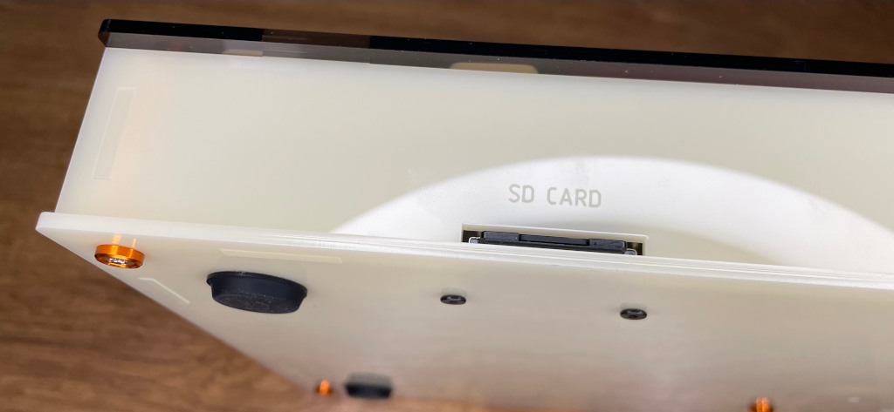
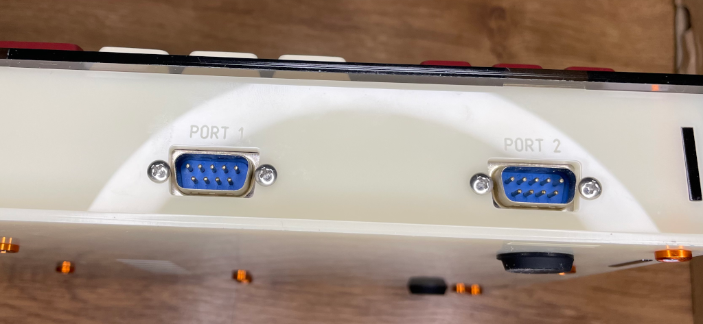

# Acrylic Enclosure for the Tides Rider MSX 2+ Computer

## Introduction

The [Tides Rider](https://genami.shop/products/tides-rider-hdk) by Miguel Fides is a [MSX 2+ compatible computer](https://en.wikipedia.org/wiki/MSX) made mostly from discrete chips.

This acrylic enclosure has been designed with the following requirements in mind:
* use a reduced space format, but allow a full [Omega Home Computer](https://github.com/skiselev/omega) keyboard
* fully enclose the Tides Rider PCB
* use top loading cartridge slots
* use the original motherboard connectors when possible
* provide accessible power and reset buttons
* provide access to the SD card slot
* keep the look MSX-like

## [Enclosure](enclosure/)

The enclosure is designed for 3mm acrylic sheet and must be cut by laser for optimal results.

There is a set of opaque pieces and another set of semi-transparent pieces.

* [tidesrider-case-v1-revc-3mm-dina3-crema-frrebole-ready-to-lasercut.dxf](enclosure/tidesrider-case-v1-revc-3mm-dina3-crema-frrebole-ready-to-lasercut.dxf)
* [tidesrider-case-v1-revc-3mm-dina3-tobaco-to-ready-to-lasercut.dxf](enclosure/tidesrider-case-v1-revc-3mm-dina3-tobaco-to-ready-to-lasercut.dxf)

## Building the enclosure

TBD

### Required material

TBD

* One 3mm DINA3 297×420mm colored opaque acrylic sheet (cream color in the images)
* One 3mm DINA3 297×420mm semi-transparent acrylic sheet (tobacco color in the images)
* ...

### Assembly instructions

TBD

## References

Tides Rider
* https://genami.shop/products/tides-rider-hdk

Omega Home Computer
* https://github.com/skiselev/omega
* https://msxmakers.design.blog/proyectos/proyectos-msx/omega-home-computer/#presentacion
